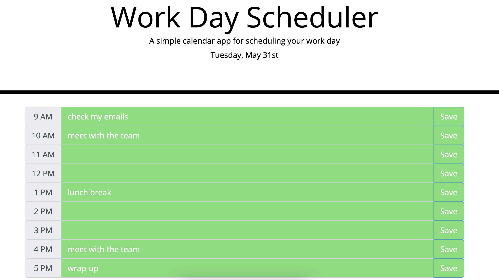

# Work Day Scheduler

A simple, lightweight, easy-to-use app to plan your work day ahead.

Technologies used: HTML, CSS, JavaScript, Bootstrap, jQuery, moment.js

Sample of the app in action: 

View the app [here](https://aaronhleung.github.io/hw5-work-day-scheduler/)!